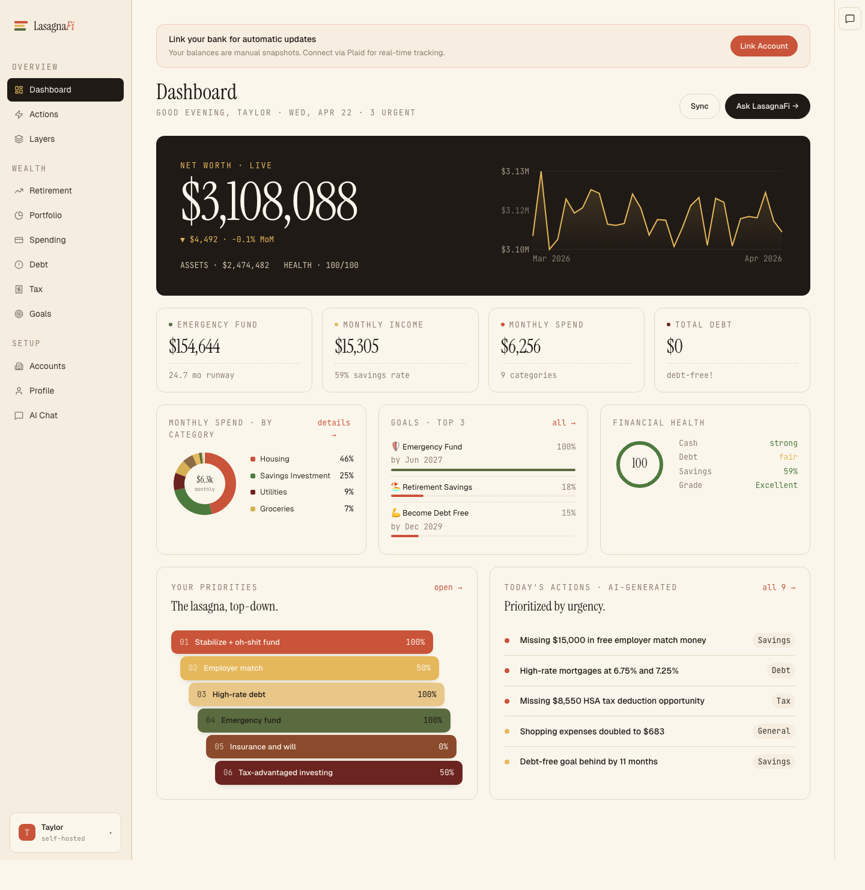
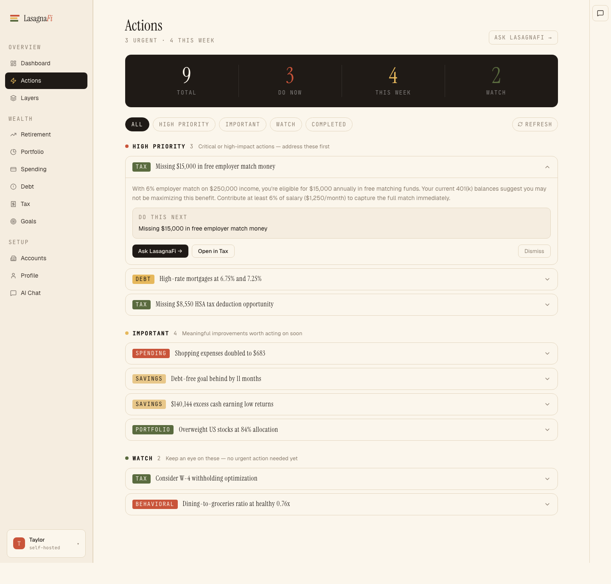
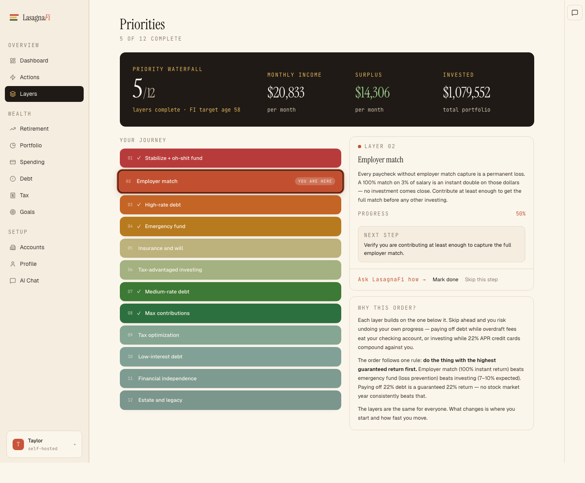
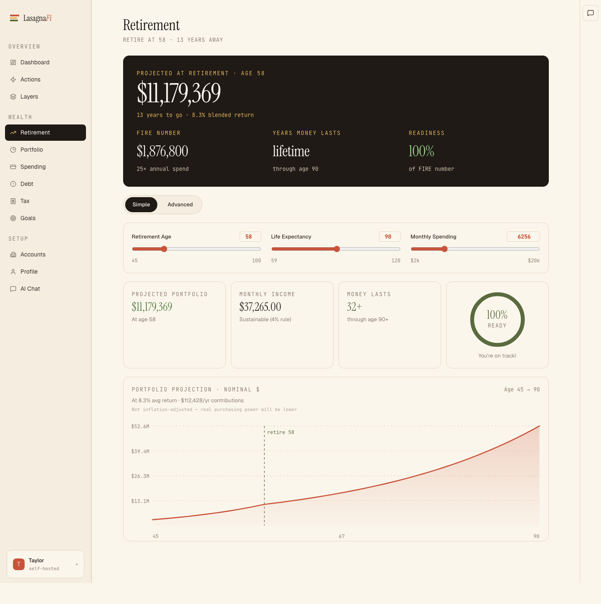
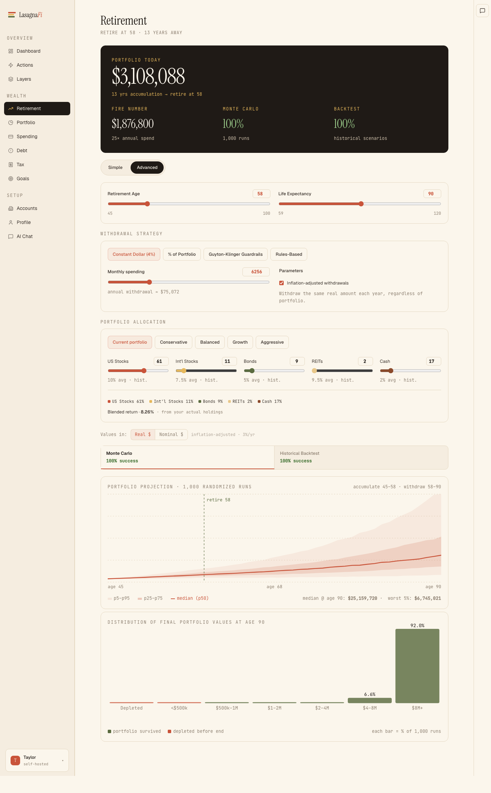
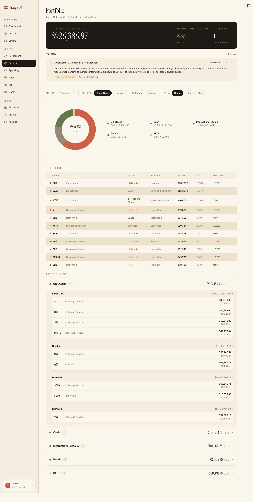
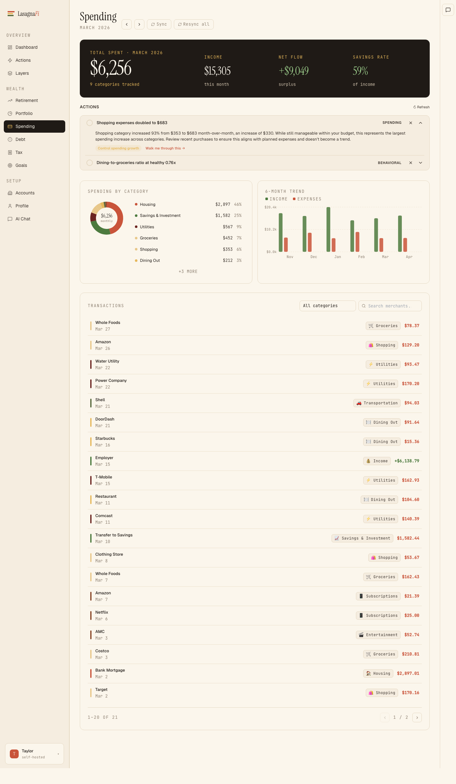
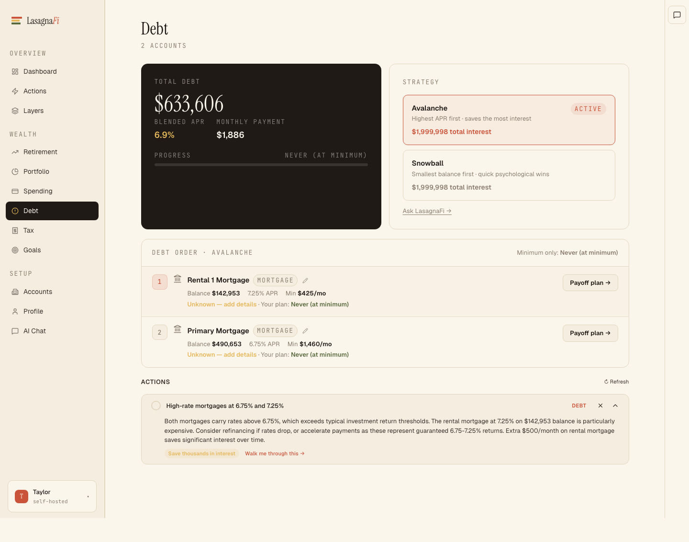
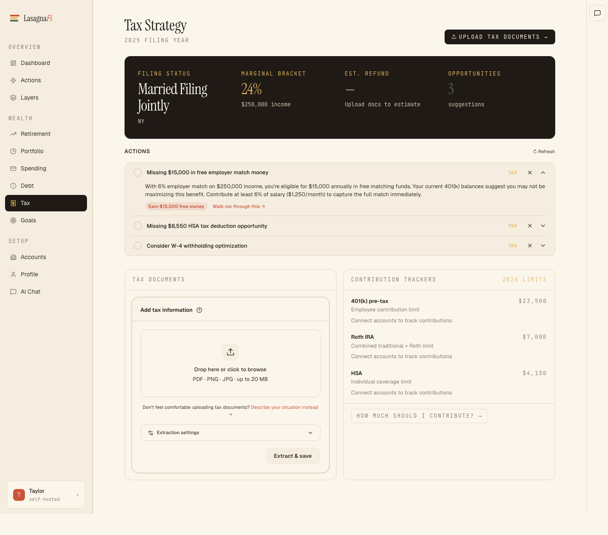

<p align="center">
  
</p>

<h1 align="center">Lasagna</h1>

<p align="center">
  <a href="#how-it-works">How it works</a> ·
  <a href="#features">Features</a> ·
  <a href="#screenshots">Screenshots</a> ·
  <a href="#tech-stack">Tech Stack</a> ·
  <a href="#quick-start">Quick Start</a> ·
  <a href="#self-hosting">Self-Hosting</a>
</p>

---

Most financial apps want your data so they can sell it, train on it, or monetize it. LasagnaFi inverts that model. The AI sees numbers and patterns, never your name, account numbers, or institution details.

Ask anything about your finances and get genuinely personalized advice without handing a model provider a map of your financial life. Your data stays in a private database, not shared with anyone.

---

## How it works

**1. Your data stays private**
Connect bank accounts via Plaid or enter balances manually. All accounts, holdings, and transactions live in a private database. Never shared with AI providers.

**2. You ask a question**
Ask anything in plain English: "Am I saving enough for retirement?" or "Should I pay down debt or invest?" Lasagna pulls the relevant numbers from your database and assembles context for the AI.

**3. The AI gets anonymous context**
Before anything reaches the AI, identifying information is stripped. It sees balances, allocations, and spending patterns, never your name, which bank you use, or account numbers.

**4. You get a real answer**
AI responds with personalized, actionable advice based on your actual numbers. You can drill down, follow up, and ask anything. The model never retains your data between sessions.

**Your data, your rules.** Lasagna runs self hosted or you can use the hosted version.

---

## Features

### Dashboard
Your complete financial picture at a glance. Net worth with a 30-day sparkline, cash and savings, monthly income and spending, goals progress, and AI-generated action items.

### Actions
AI-generated action items across every area of your finances, prioritized by urgency. Covers spending patterns, debt, tax opportunities, portfolio imbalances, and behavioral insights. Grouped by urgency with one-tap navigation to the relevant page.

### Financial Priorities (Your Lasagna Layers)
12 universal layers, from stabilizing your finances to financial independence. The AI figures out where you are and tells you what to focus on next. Backed by rule-based logic, not generic advice.

### Retirement Planning
Interactive retirement modeling with age and spending sliders, FIRE number calculation, portfolio projection charts, and a retirement readiness meter. Pulls directly from your live account balances.

### Monte Carlo Simulations
10,000 stochastic simulations modeling your probability of success across retirement. Fan charts (p5–p95), spaghetti charts, final value histograms, and historical backtesting against every market period since 1928, including 2008, the Great Depression, and stagflation.

### Portfolio Analysis
Aggregate all holdings across accounts. Drill down by asset class, sub-category, or individual ticker. Interactive donut, bar, and treemap charts. Blended historical return calculations with 175+ tickers mapped to asset categories.

### Spending Tracker
Monthly expense breakdown by category with 6-month trend charts and full transaction history (searchable, filterable, paginated). Synced automatically via Plaid or entered manually.

### Debt Management
Complete debt overview with APRs, avalanche vs. snowball payoff comparison, days-to-debt-free timeline, and total interest savings calculation. Syncs payoff dates and interest rates directly from Plaid where available.

### Tax Strategy
AI-generated tax optimization recommendations: Roth conversion opportunities, 0% LTCG bracket harvesting, HSA optimization, asset location, and 401k contribution gap analysis. Upload tax documents for AI-assisted extraction.

### Goals
Track financial goals with progress bars, preset templates, inline editing, and completion tracking.

### AI Chat
Ask anything about your finances in plain English. 12 specialized financial tools let the AI read your accounts, run projections, and give personalized recommendations. All using anonymous data. Your conversation history stays in your database, not the AI provider's.

---

## Screenshots

<table>
  <tr>
    <td align="center"><strong>Dashboard</strong></td>
    <td align="center"><strong>Actions</strong></td>
  </tr>
  <tr>
    <td></td>
    <td></td>
  </tr>
  <tr>
    <td align="center"><strong>Your Layers</strong></td>
    <td align="center"><strong>Retirement Plan</strong></td>
  </tr>
  <tr>
    <td></td>
    <td></td>
  </tr>
  <tr>
    <td align="center"><strong>Retirement (Advanced)</strong></td>
    <td></td>
  </tr>
  <tr>
    <td></td>
    <td></td>
  </tr>
  <tr>
    <td align="center"><strong>Portfolio Analysis</strong></td>
    <td align="center"><strong>Spending Tracker</strong></td>
  </tr>
  <tr>
    <td></td>
    <td></td>
  </tr>
  <tr>
    <td align="center"><strong>Debt Management</strong></td>
    <td align="center"><strong>Tax Strategy</strong></td>
  </tr>
  <tr>
    <td></td>
    <td></td>
  </tr>
</table>

---

## Tech Stack

| Layer | Technology |
|---|---|
| Frontend | React 19, Vite, Tailwind CSS, Recharts, Vega-Lite, Framer Motion |
| Backend | Hono (Node.js), TypeScript |
| Database | PostgreSQL 16, Drizzle ORM |
| Auth | Custom JWT (bcrypt + sessions) |
| AI | OpenRouter (model-agnostic) |
| Banking | Plaid API |
| Deployment | Docker, GCP Cloud Run, Cloudflare Pages |

---

## Quick Start

### Prerequisites

- Node.js >= 20
- pnpm >= 9
- PostgreSQL (or Docker)

### With Docker (recommended)

```bash
git clone https://github.com/dmanjunath/lasagna.git
cd lasagna

cp .env.example .env
# Fill in: ENCRYPTION_KEY, and optional Plaid/OpenRouter credentials
# (see .env.example for all variables)

docker compose up
```

The app will be available at `http://localhost:5173`.

### Without Docker

```bash
pnpm install

# Start a local PostgreSQL instance, then:
pnpm db:push      # apply schema
pnpm db:seed      # load sample data (optional)

pnpm dev          # API on :3000
pnpm dev:web      # Web on :5173 (separate terminal)
```

### Seed Sample Data

```bash
pnpm db:seed --preset=negative   # debt climber, $-60k net worth
pnpm db:seed --preset=100k       # early builder, $100k
pnpm db:seed --preset=750k       # accumulator, $750k
pnpm db:seed --preset=1.8M       # pre-retiree, $1.8M
pnpm db:seed --preset=4M         # high net worth, $4M
```

---

## Self-Hosting

### Environment Variables

| Variable | Description | Required |
|---|---|---|
| `DATABASE_URL` | PostgreSQL connection string | Yes |
| `ENCRYPTION_KEY` | 32-byte hex key for encrypting Plaid tokens (`openssl rand -hex 32`) | Yes |
| `PLAID_CLIENT_ID` | Plaid API client ID | Optional |
| `PLAID_SECRET` | Plaid API secret | Optional |
| `PLAID_ENV` | `sandbox`, `development`, or `production` | Optional |
| `OPENROUTER_API_KEY` | OpenRouter key for AI chat | Optional |

Plaid is required only if you want live bank account syncing. Without it, you can still use the app by entering balances manually. The AI chat feature requires an OpenRouter API key.

### Deployment

```bash
pnpm build           # builds all packages
pnpm typecheck       # type-check everything
pnpm lint            # lint
pnpm --filter @lasagna/core test   # unit tests
```

---

## Deployments

This repo powers three separate deployments:

| URL | Package | Description |
|-----|---------|-------------|
| `lasagnafi.com` | `packages/landing` | Marketing landing page (Astro) |
| `app.lasagnafi.com` | `packages/web` | Hosted app |
| `demo.lasagnafi.com` | `packages/web` | Read-only demo (set `VITE_DEMO_MODE=true`) |

**Cloudflare Pages configuration:**
Each deployment is a separate Cloudflare Pages project pointing to the same GitHub repo, with different build settings:

| Deployment | Build command | Output dir | Env vars |
|---|---|---|---|
| `lasagnafi.com` | `pnpm --filter @lasagna/landing build` | `packages/landing/dist` | `PUBLIC_VIDEO_URL` (optional) |
| `app.lasagnafi.com` | `pnpm --filter @lasagna/web build` | `packages/web/dist` | standard |
| `demo.lasagnafi.com` | `pnpm --filter @lasagna/web build` | `packages/web/dist` | `VITE_DEMO_MODE=true` |

**Demo user:** Run `pnpm db:seed-demo` to create `demo@lasagnafi.com` / `lasagna123`.

**Production API CORS:** Set `CORS_ORIGIN=https://app.lasagnafi.com,https://demo.lasagnafi.com`.

---

## Contributing

Issues and PRs are welcome. Please open an issue first for significant changes.

---

> **Disclaimer:** Lasagna is a personal finance tool, not licensed financial advice. All projections and recommendations are for informational purposes only.
