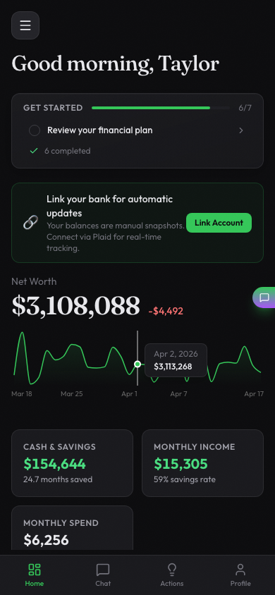
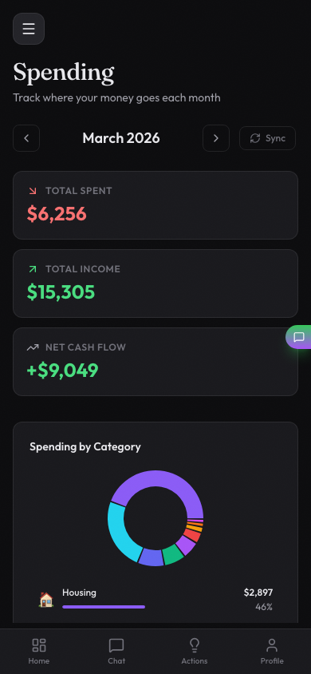
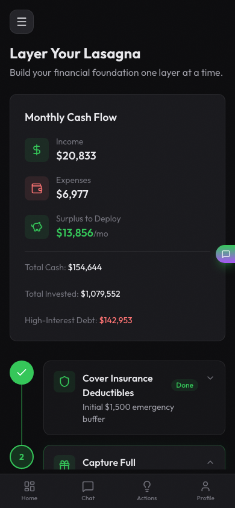

<p align="center">
  
</p>

<h1 align="center">Lasagna</h1>
<p align="center"><strong>Self-hosted AI financial advisor. Build your financial foundation one layer at a time.</strong></p>

<p align="center">
  <a href="#features">Features</a> ·
  <a href="#screenshots">Screenshots</a> ·
  <a href="#tech-stack">Tech Stack</a> ·
  <a href="#quick-start">Quick Start</a> ·
  <a href="#self-hosting">Self-Hosting</a> ·
  <a href="#contributing">Contributing</a>
</p>

---

Lasagna is a self-hosted personal finance platform that helps you manage your financial life. While not a replacement for a real financial advisor, Lasagna can help you get most of the way there on your own and it answers three questions
1. Where do I get started managing my fnances?
2. What to do next?
3. Am I on track for retirement?

While there are some budgeting features, it's not a budgeting app, it's much more. It gives you insights about how to best pay off your debts, runs projections about your investment portfolio and gives you insights about your entire financial picture. Doesn't matter if you have 200k in student loans or a $50 million dollar portfolio.

---

## Features

### Dashboard
Your complete financial picture at a glance. Net worth with a 30-day sparkline, cash and savings, monthly income and spending, goals progress, and AI-generated action items.

### Actions
AI-generated action items across every area of your finances, prioritized by urgency. Covers spending patterns, debt, tax opportunities, portfolio imbalances, and behavioral insights. Grouped by urgency with one-tap navigation to the relevant page.

### Financial Priorities (Your Lasagna Layers)
A personalized financial plan that tells you exactly what to focus on right now — insurance deductibles, emergency fund, employer match, debt, HSA, Roth IRA, 401k, accumulation, and surplus investing. Backed by rule-based logic, not generic advice.

### Retirement Planning
Interactive retirement modeling with age and spending sliders, FIRE number calculation, portfolio projection charts, and a retirement readiness meter. Pulls directly from your live account balances.

### Monte Carlo Simulations
10,000 stochastic simulations modeling your probability of success across retirement. Fan charts (p5–p95), spaghetti charts, final value histograms, and historical backtesting against every market period since 1928, including 2008, the Great Depression, and stagflation.

### Portfolio Analysis
Aggregate all holdings across accounts. Drill down by asset class, sub-category, or individual ticker. Interactive donut, bar, and treemap charts. Blended historical return calculations with 175+ tickers mapped to asset categories.

### Spending Tracker
Monthly expense breakdown by category with 6-month trend charts and full transaction history (searchable, filterable, paginated). Synced automatically via Plaid or entered manually.

### Debt Management
Complete debt overview with APRs, avalanche vs. snowball payoff comparison, days-to-debt-free timeline, and total interest savings calculation. Syncs payoff dates and interest rates directly from Plaid where available.

### Tax Strategy
AI-generated tax optimization recommendations: Roth conversion opportunities, 0% LTCG bracket harvesting, HSA optimization, asset location, and 401k contribution gap analysis. Upload tax documents for AI-assisted extraction.

### Goals
Track financial goals with progress bars, preset templates, inline editing, and completion tracking.

### AI Chat Agent
Ask anything about your finances. Powered by Claude with 12 specialized financial tools — it can read your accounts, run projections, and give personalized recommendations, all in a persistent conversation thread.

---

## Screenshots

<table>
  <tr>
    <td align="center"><strong>Dashboard</strong></td>
    <td align="center"><strong>Actions</strong></td>
  </tr>
  <tr>
    <td></td>
    <td></td>
  </tr>
  <tr>
    <td align="center"><strong>Your Layers</strong></td>
    <td align="center"><strong>Retirement Plan</strong></td>
  </tr>
  <tr>
    <td></td>
    <td></td>
  </tr>
  <tr>
    <td align="center"><strong>Portfolio Analysis</strong></td>
    <td align="center"><strong>Spending Tracker</strong></td>
  </tr>
  <tr>
    <td></td>
    <td></td>
  </tr>
  <tr>
    <td align="center"><strong>Debt Management</strong></td>
    <td align="center"><strong>Tax Strategy</strong></td>
  </tr>
  <tr>
    <td></td>
    <td></td>
  </tr>
</table>

### Mobile

<p>
  
  &nbsp;&nbsp;
  
  &nbsp;&nbsp;
  
</p>

---

## Tech Stack

| Layer | Technology |
|---|---|
| Frontend | React 19, Vite, Tailwind CSS, Recharts, Vega-Lite, Framer Motion |
| Backend | Hono (Node.js), TypeScript |
| Database | PostgreSQL 16, Drizzle ORM |
| Auth | Custom JWT (bcrypt + sessions) |
| AI | Claude (via OpenRouter) |
| Banking | Plaid API |
| Deployment | Docker, GCP Cloud Run, Cloudflare Pages |

---

## Quick Start

### Prerequisites

- Node.js >= 20
- pnpm >= 9
- PostgreSQL (or Docker)

### With Docker (recommended)

```bash
git clone https://github.com/dmanjunath/lasagna.git
cd lasagna

cp .env.example .env
# Fill in: ENCRYPTION_KEY, and optional Plaid/OpenRouter credentials
# (see .env.example for all variables)

docker compose up
```

The app will be available at `http://localhost:5173`.

### Without Docker

```bash
pnpm install

# Start a local PostgreSQL instance, then:
pnpm db:push      # apply schema
pnpm db:seed      # load sample data (optional)

pnpm dev          # API on :3000
pnpm dev:web      # Web on :5173 (separate terminal)
```

### Seed Sample Data

The seed script creates realistic demo users across different wealth levels:

```bash
# Pick a preset that matches your financial situation for testing
pnpm db:seed --preset=negative   # debt climber, $-60k net worth
pnpm db:seed --preset=100k       # early builder, $100k
pnpm db:seed --preset=750k       # accumulator, $750k
pnpm db:seed --preset=1.8M       # pre-retiree, $1.8M
pnpm db:seed --preset=4M         # high net worth, $4M
```

---

## Self-Hosting

### Environment Variables

| Variable | Description | Required |
|---|---|---|
| `DATABASE_URL` | PostgreSQL connection string | Yes |
| `ENCRYPTION_KEY` | 32-byte hex key for encrypting Plaid tokens (`openssl rand -hex 32`) | Yes |
| `PLAID_CLIENT_ID` | Plaid API client ID | Optional |
| `PLAID_SECRET` | Plaid API secret | Optional |
| `PLAID_ENV` | `sandbox`, `development`, or `production` | Optional |
| `OPENROUTER_API_KEY` | OpenRouter key for AI chat (Claude) | Optional |

Plaid is required only if you want live bank account syncing. Without it, you can still use the app by entering balances manually. The AI chat feature requires an OpenRouter key.

### Deployment

The API is a standard Node.js/Hono server and can be deployed anywhere. The web app is a static Vite build. A `Dockerfile` is included for container-based deployments.

```bash
pnpm build           # builds all packages
pnpm typecheck       # type-check everything
pnpm lint            # lint
pnpm --filter @lasagna/core test   # unit tests
```

---

## Contributing

Issues and PRs are welcome. Please open an issue first for significant changes.

---

> **Disclaimer:** Lasagna is a personal finance tool, not licensed financial advice. All projections and recommendations are for informational purposes only.
